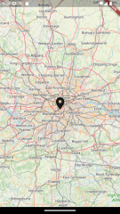
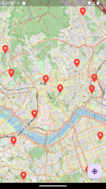

# openstreetmap

A new Flutter project.

## Getting Started

This project is a starting point for a Flutter application.

A few resources to get you started if this is your first Flutter project:

- [Lab: Write your first Flutter app](https://docs.flutter.dev/get-started/codelab)
- [Cookbook: Useful Flutter samples](https://docs.flutter.dev/cookbook)

For help getting started with Flutter development, view the
[online documentation](https://docs.flutter.dev/), which offers tutorials,
samples, guidance on mobile development, and a full API reference.

## Screenshot




## Installing

- [flutter_map](https://github.com/fleaflet/flutter_map)  
  A wrapper around InheritedWidget to make them easier to use and more reusable.

  ```shell
  fvm flutter pub add flutter_map
  fvm flutter pub add latlong2
  ```

  Import it

  ```dart
  import 'package:flutter_map/flutter_map.dart';
  ```

- [flutter_map_marker_cluster](https://github.com/lpongetti/flutter_map_marker_cluster)  
  Provides beautiful animated marker clustering functionality for flutter_map. Inspired by Leaflet.markercluster

  ```shell
  fvm flutter pub add flutter_map_marker_cluster
  ```

  Import it

  ```dart
  import 'package:flutter_map_marker_cluster/flutter_map_marker_cluster.dart';
  ```

- [flutter-geolocator](https://github.com/Baseflow/flutter-geolocator)  
  Android and iOS Geolocation plugin for Flutter

  ```shell
  fvm flutter pub add geolocator
  ```

  Import it

  ```shell
  import 'package:geolocator/geolocator.dart';
  ```

- [url_launcher](https://github.com/flutter/packages/tree/main/packages/url_launcher/url_launcher)  
  A Flutter plugin for launching a URL.

  ```shell
  fvm flutter pub add url_launcher
  ```

  Import it

  ```shell
  import 'package:url_launcher/url_launcher.dart';
  ```

## Configure

Edit `ios/Runner/info.plist`

```xml
<?xml version="1.0" encoding="UTF-8"?>
<plist version="1.0">
<dict>
    ...
    <key>NSLocationWhenInUseUsageDescription</key>
    <string>This app needs access to location when open.</string>
    <key>NSLocationAlwaysUsageDescription</key>
    <string>This app needs access to location when in the background.</string>
</dict>
</plist>
```

Edit `android/app/src/main/AndroidMainfest.xml`

```xml
<manifest ... >
    <uses-permission android:name="android.permission.INTERNET"/>
    <uses-permission android:name="android.permission.ACCESS_COARSE_LOCATION" />
    <uses-permission android:name="android.permission.ACCESS_FINE_LOCATION" />
    <uses-permission android:name="android.permission.ACCESS_BACKGROUND_LOCATION" />
    ...
</manifest>
```

Edit `android/app/src/main/AndroidMainfest.xml`

```xml
<?xml version="1.0" encoding="UTF-8"?>
<plist ... >
<dict>
    ...
    <key>NSAppTransportSecurity</key>
    <dict>
        <key>NSAllowsArbitraryLoads</key><true/>
    </dict>
</dict>
</plist>
```